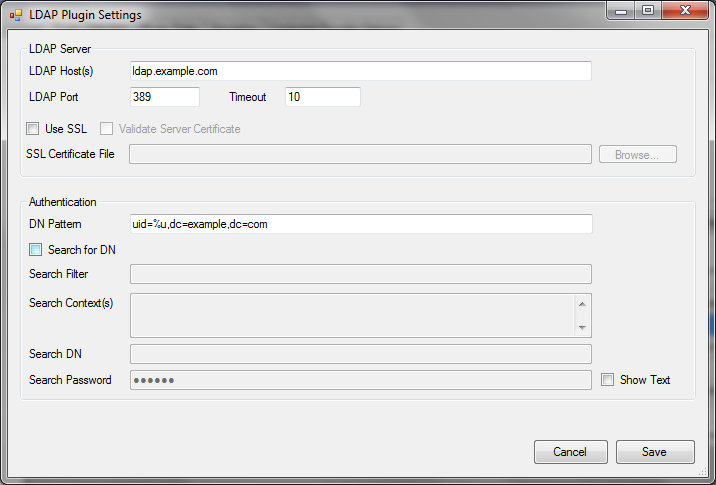

LDAP Authentication Plugin Documentation
===================

* **Plugin Name:** LDAP Authentication
* **Plugin Type:** Authentication
* **Latest Version:** 3.0.2.0

How the LDAP Plugin Works
--------------------------

The LDAP Authentication plugin provides authenication services via a LDAP server.  It maps the user
name to a LDAP Distinguished Name (DN) and attempts to bind to the LDAP server using the DN.
If the bind is successful, it provides a positive result to the pGina service.  

The user name can be mapped to a DN by one of two means: via simple pattern substitution, or via a 
search of the LDAP database.  When a search is used, the plugin connects to the LDAP server
anonymously (or via supplied credentials) and attempts to find an entry for the user.  If the
entry is found, the plugin closes the connection and attempts to bind again using the DN of 
the entry, and the password provided by the user.  If this bind is successful, the 
plugin registers success.

The LDAP Authentication plugin provides support for SSL encryption and failover to one or more
alternate servers.

Typical Setup
-------------------

A typical (minimal) setup for LDAP authentication is to enable the Local Machine plugin in the 
authentication and gateway stages, and enable LDAP in the authentication stage.  Within the 
authentication stage, order the LDAP plugin before Local Machine.

Configuration
---------------

The configuration interface for the LDAP authentication plugin is shown below.

Each configuration option is described below:

* **LDAP Host(s):** -- A space separated list of one or more LDAP servers.  This field supports
IP addresses or fully qualified domain names.
* **LDAP Port** -- The port used when connecting to the LDAP server(s).  Typically, this is
389 for non-SSL connections (or connections using StartTLS), and 636 when SSL is used.
* **Timeout** -- This is the number of seconds to wait for a response from a server before
giving up (and possibly moving on to the next server in the list).
* **Use SSL** -- Whether or not to use SSL encryption when connecting to the server(s).
* **Verify Server Certificate** -- Whether or not to verify the server's public certificate with
a local certificate or certificate store.  When this option is selected, the connection will fail
if the server's certificate does not validate.
* **SSL Certificate File** -- If you have selected "Verify Server Certificate," you can provide
a copy of the server's public SSL certificate here.  The certificate should be provided in the
"PEM" format that is the default for OpenSSL.  If this field is left blank, the plugin will attempt
to use the Windows certificate store to validate the certificate.
* **DN Pattern** -- If "Search for DN" is not selected, the user name is mapped to a DN using this
pattern.  The substring `%u` will be replaced with the user name.
* **Search for DN** -- When this option is selected, the "DN Pattern" (mentioned above) is not
used.  Instead, the plugin will attempt to connect to the LDAP server (using the credentials 
supplied in the following options), and search for an entry.  If the entry is found, the DN for 
the entry is used to re-bind to the server.  If the re-bind succeeds, the plugin registers success.
* **Search Filter** -- This is a LDAP search filter to be used when searching for the DN.  For
more information on LDAP search filters, see [this RFC](http://tools.ietf.org/html/rfc4515),
or any LDAP book.  If the string `%u` appears in the filter, it will be replaced by the user name.
* **Search Context(s)** -- This is a list of DNs (one per line) that are to be used as search
contexts.  This means that the search will be performed on the LDAP subtree rooted at each of these
DNs.
* **Search DN** -- The DN to use when binding to the server in order to perform the search.  If
this is left empty, the plugin will attempt to bind anonymously.
* **Search Password** -- The password to use when binding with the above DN.  This is ignored if
the "Search DN" field is empty.  
