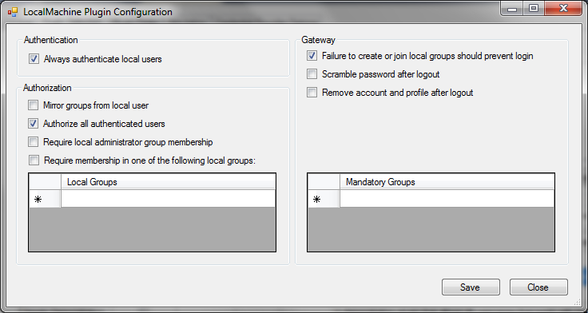

pGina Local Machine Plugin Documentation
===================

* **Plugin Name:** Local Machine
* **Plugin Type:** Authentication, Authorization, Gateway
* **Latest Version:** 3.0.2.0

How it Works
--------------------

The local machine plugin manages authentication and authorization for accounts
that exist on the machine itself.  It also is responsible for creating local
accounts (possibly temporary ones) when a user is authorized to log in, but
does not have a local account.

The local machine plugin can execute in any of the three main pGina stages
(authentication, authorization, and gateway).  

<h3>Authentication Stage</h3>

In the authentication stage, the local machine plugin attempts to authenticate
the user's credentials against an existing local account.  If the local user 
account does not exist, or the credentials do not match, the
plugin registers failure for this stage.

It can be configured
to always authenticate, or to only do so if the user has not already 
been authenticated by a plugin that was executed earlier within this stage.

Note that you probably always want to make sure that the local machine plugin
is enabled in the authentication stage.  If not, you risk being unable to
log into the machine if for some reason the alternate authentication methods
fail (such as a network issue).

<h3>Authorization Stage</h3>

The local machine plugin authorizes users based on group membership.  It can be 
configured such that a user must be a member of the administrator group to be
authorized, and/or the user must be a member of one of a set of other local
groups.

The plugin can also be configured to only apply these rules to accounts that
were authenticated by this plugin and not to others.  Or alternatively, it can
apply these authorization rules to all authenticated users.

<h3>Gateway Stage</h3>

If enabled in the gateway stage, the local machine plugin ensures that the
authenticated (and authorized) user has a local account.  If not, one is created.
It also makes sure that the local account has the appropriate group membership.
You can configure the plugin to add the user to a set of mandantory groups.

The plugin can also be configured such that the local account should be scheduled
for removal or have it's password scrambled upon logoff.

Configuration
--------------------

TODO...