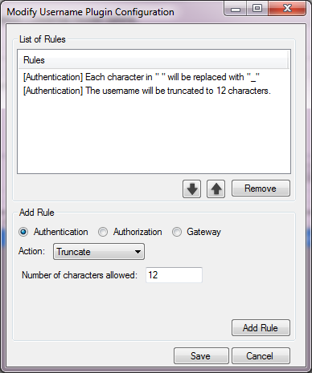

Username Modification Plugin Documentation
===================

* **Plugin Name:** Username Modification
* **Plugin Type:** Authenticationm, Authorization, Gateway
* **Latest Version:** 3.0.0.0

How it Works
--------------------
The username modification plugin provides several options for
modifying the username during the login process. 

Typical Setup
--------------------
The username modification plugin will not typically be used on
it's own. It is designed to modify the entered username to conform
to specific standards of the primary plugin(s). Examples of this
include replacing specific characters that are not typically allowed in Windows
usernames.

Configuration
--------------------

The configuration interface for the username modification plugin is
shown below.

When adding a new rule, you'll be faced with the following options:

## Stages

The stage you want the username modification to take place in. A brief description of the 
stages:

* **Authentication** -- The authentication stage is where the username is verified 
by the external service (e.g. LDAP, email server). 
* **Authorization** -- The authorization stage is where group membership is defined 
and modified.
* **Gateway** -- The gateway stage is responsible for last minute substitutions 
and assigning ooptions.

See the [pGina Users Guide](user.html#plugins) for more info. 

## List of Rules

The list of rules currently set. When changing the order
of rules, you may only change the order of rules in the same stage. E.g. You may
not swap an authentication and a authorization rule, since the authentication step
takes place first.

## Add Rule

Adds the specified rule to the rules list.  

## The rules are described below.

### Append
Appends the specified string to the end of the username.

### Prepend
Prepends the specified string to the beginning of the username.

### Truncate
Truncates the username to the specified number of characters.

* If the number of characters allowed is 7, the username "Bob Loblaw" becomes "Bob Lob"

### Replace
Replaces each specified character in the first string with the second string. 
If the second string is left blank, the characters will be removed. 
Characters are case sensitive.

* For the rule '*Replace "abc" with "zz"*', the username "Bob Loblaw" becomes "Bozz Lozzlzzw"

### RegEx Replace
Replaces all matches for the specified regex expression with the specified string. 
If the second specified string is left blank, the matches will be removed.

* For the rule '*Each regex match for "\s+" will be replaced with ""*', the username 
"user &nbsp;&nbsp;name" becomes "username"
* For the rule '*Each regex match for "ob" will be replaced with "aw"*', the username 
"Bob Loblaw" becomes "Baw Lawlaw"

### Match

Rather than modifying the username, the match rule checks to see if the username 
conforms to the specified regular expression.

During the authentication stage, if ANY match rule matches the username, the user 
will be authenticated WITHOUT verifying the password.

* For the rule '*The username must mach "^p"*', the username "pGina" will authenticate without checking the password. 
    The username "Bob Loblaw" will not automatically authenticate unless the username/password works against another authentication method. 

During the authorization and gateway stages, the default behavior is to authorize the username unless one of the match rules fail. 
A failure during either of these two stages will prevent login.
